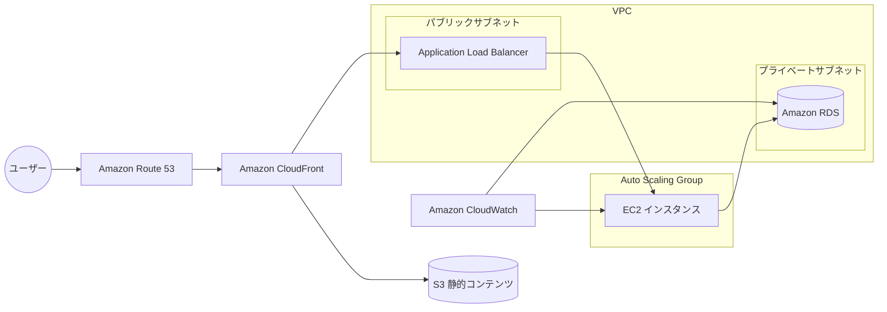

# シンプルなWebアプリケーションのAWSインフラストラクチャ

Amazon Q CLIによって作成されたTerraformコード集です。
このプロジェクトは、高可用性と堅牢なセキュリティを備えたWebアプリケーションのためのAWSインフラストラクチャを構築します。AWS Well-Architectedフレームワークに準拠し、Checkovによるセキュリティチェックに合格するように設計されています。

## アーキテクチャ概要

このインフラストラクチャは、マルチAZ構成の高可用性アーキテクチャを実現し、静的コンテンツと動的コンテンツを分離して効率的に配信します。



## セキュリティ対策

- **データ保護**:
  - すべてのS3バケットはKMSによるサーバーサイド暗号化を実施
  - 保存データと転送中のデータの暗号化
  - S3バケットのパブリックアクセス禁止設定
  - バージョニングによる誤削除防止

- **災害対策**:
  - クロスリージョンレプリケーションによるデータ冗長化
  - マルチAZ構成によるリージョン内の可用性確保

- **ネットワークセキュリティ**:
  - WAFによるWebアプリケーション保護（SQLインジェクション、XSS、Log4j脆弱性対策を含む）
  - プライベートサブネットでのEC2インスタンス実行
  - セキュリティグループによる最小権限アクセス制御

- **データベースセキュリティ**:
  - RDSインスタンスの暗号化とIAM認証
  - 自動バックアップと特定時点へのリカバリ機能

- **通信セキュリティ**:
  - CloudFrontによるHTTPS通信の強制
  - セキュリティヘッダーポリシーの適用（HSTS、XSS保護など）

## ファイル構成

- **main.tf** - プロバイダー設定と基本的なデータソース
- **network.tf** - VPC、サブネット、ルートテーブルなどのネットワークリソース
- **security_groups.tf** - セキュリティグループとルール
- **s3.tf** - S3バケットとその設定
- **encryption.tf** - KMSキーと暗号化設定
- **alb.tf** - Application Load Balancerとリスナー
- **compute.tf** - EC2インスタンス、起動テンプレート、Auto Scaling Group
- **database.tf** - RDSインスタンスと関連設定
- **cloudfront.tf** - CloudFrontディストリビューション
- **waf.tf** - WAFウェブACLと設定
- **dns.tf** - Route 53ゾーンとレコード
- **monitoring.tf** - CloudWatchダッシュボードとアラーム
- **replication.tf** - S3クロスリージョンレプリケーション
- **notifications.tf** - S3イベント通知
- **replication_logging.tf** - レプリカリージョンのログ設定

## 前提条件

- Terraform v1.0.0以上
- AWS CLIがインストールされ、適切に設定されていること
- 適切なIAM権限を持つAWSアカウント
- ドメイン名（Route 53で管理するか、既存のドメインを使用）

## 使用方法

1. リポジトリをクローンする

    ```bash
    git clone https://github.com/yourusername/webapp-aws-infra.git
    cd webapp-aws-infra
    ```

2. 変数を設定する

    ```bash
    cp terraform.tfvars.example terraform.tfvars
    ```

    以下は`terraform.tfvars`の設定例です：

    ```hcl
    aws_region       = "ap-northeast-1"
    project_name     = "mywebapp"
    domain_name      = "mywebapp.com"
    vpc_cidr         = "10.0.0.0/16"
    instance_type    = "t3.micro"
    db_instance_class = "db.t3.small"
    ```

3. Terraformを初期化する

    ```bash
    terraform init
    ```

4. 実行計画を確認する

    ```bash
    terraform plan
    ```

5. インフラストラクチャをデプロイする

    ```bash
    terraform apply
    ```

6. デプロイ後の確認

    ```bash
    # CloudFrontディストリビューションのドメイン名を取得
    terraform output cloudfront_domain_name
    
    # RDSエンドポイントを取得
    terraform output rds_endpoint
    ```

7. リソースを削除する（必要な場合）

    ```bash
    terraform destroy
    ```

## 重要な変数

| 変数名 | 説明 | デフォルト値 |
|--------|------|------------|
| aws_region | AWSリージョン | ap-northeast-1 |
| project_name | プロジェクト名（リソース名のプレフィックスとして使用） | webapp |
| vpc_cidr | VPCのCIDRブロック | 10.0.0.0/16 |
| availability_zones | 使用するアベイラビリティゾーン | ["ap-northeast-1a", "ap-northeast-1c"] |
| instance_type | EC2インスタンスタイプ | t3.micro |
| db_instance_class | RDSインスタンスクラス | db.t3.small |
| domain_name | アプリケーションのドメイン名 | example.com |
| replica_region | レプリケーション先リージョン | us-west-2 |
| enable_waf | WAFを有効にするかどうか | true |
| enable_monitoring | 詳細なモニタリングを有効にするかどうか | true |

## コスト最適化

このインフラストラクチャは以下のコスト最適化戦略を採用しています：

- Auto Scalingによる需要に応じたリソース調整
- S3ライフサイクルポリシーによるストレージコスト削減
- CloudFrontによるオリジンへのリクエスト削減
- リザーブドインスタンスやSavings Plansの検討（長期運用の場合）

予算管理のために以下の設定を推奨します：

- AWS Budgetsによるコスト監視
- CloudWatchアラームによる異常検知
- タグ付けによるコスト配分の明確化

## セキュリティに関する注意

- 本番環境では、`db_password`を安全に管理してください（AWS Secrets Managerなどを使用）
- 実際のドメイン名を`domain_name`変数に設定してください
- 必要に応じてAWS Shield Advancedを追加して、DDoS攻撃からの保護を強化してください
- IAMロールは最小権限の原則に従って設定してください
- セキュリティグループのルールは定期的に見直してください

## トラブルシューティング

一般的な問題と解決策：

1. **デプロイエラー**
   - IAM権限が不足している可能性があります。必要な権限を確認してください。
   - リソース制限に達している可能性があります。Service Quotasを確認してください。

2. **接続問題**
   - セキュリティグループのインバウンドルールを確認してください。
   - ルートテーブルとNATゲートウェイの設定を確認してください。

3. **パフォーマンス問題**
   - CloudWatchメトリクスを確認して、ボトルネックを特定してください。
   - Auto Scalingポリシーを調整してください。

## カスタマイズ

このコードは基本的なWebアプリケーションインフラストラクチャを提供します。必要に応じて以下のようなカスタマイズが可能です：

- SSL証明書の追加（AWS Certificate Manager）
- ElastiCacheの追加（キャッシュ用）
- バックアップ戦略の実装
- CI/CDパイプラインの統合（AWS CodePipeline）
- コンテナ化（ECS/EKS）への移行
- サーバーレスアーキテクチャ（Lambda、API Gateway）の採用

## ライセンス

MITライセンスの下で配布されています。
