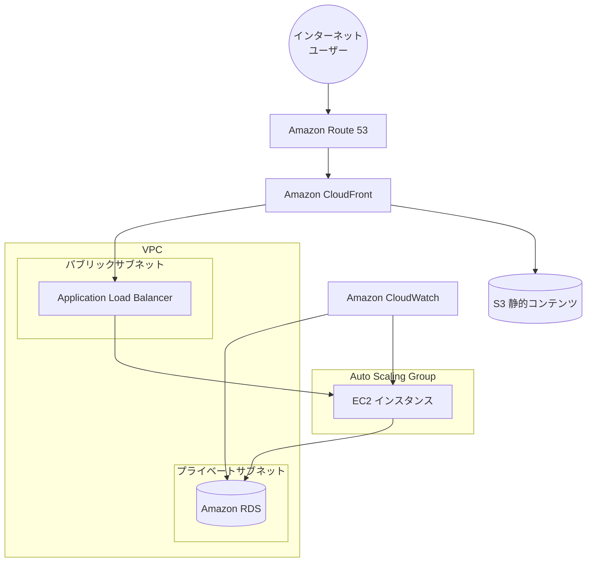

# シンプルなWebアプリケーションのAWSインフラストラクチャ

このTerraformコードは、シンプルなWebアプリケーションのためのAWSインフラストラクチャを構築します。セキュリティベストプラクティスに従い、Checkovによるセキュリティチェックに合格するように設計されています。

## アーキテクチャ



## セキュリティ対策

- すべてのS3バケットはKMSによる暗号化を実施
- クロスリージョンレプリケーションによる災害対策
- WAFによるWebアプリケーション保護（Log4j脆弱性対策を含む）
- プライベートサブネットでのEC2インスタンス実行
- RDSインスタンスの暗号化とIAM認証
- CloudFrontによるHTTPS通信の強制
- セキュリティヘッダーポリシーの適用

## ファイル構成

- **main.tf** - プロバイダー設定と基本的なデータソース
- **network.tf** - VPC、サブネット、ルートテーブルなどのネットワークリソース
- **security_groups.tf** - セキュリティグループとルール
- **s3.tf** - S3バケットとその設定
- **encryption.tf** - KMSキーと暗号化設定
- **alb.tf** - Application Load Balancerとリスナー
- **compute.tf** - EC2インスタンス、起動テンプレート、Auto Scaling Group
- **database.tf** - RDSインスタンスと関連設定
- **cloudfront.tf** - CloudFrontディストリビューション
- **waf.tf** - WAFウェブACLと設定
- **dns.tf** - Route 53ゾーンとレコード
- **monitoring.tf** - CloudWatchダッシュボード
- **replication.tf** - S3クロスリージョンレプリケーション
- **notifications.tf** - S3イベント通知
- **replication_logging.tf** - レプリカリージョンのログ設定

## 前提条件

- Terraform v1.0.0以上
- AWS CLIがインストールされ、適切に設定されていること
- 適切なIAM権限を持つAWSアカウント

## 使用方法

1. リポジトリをクローンする

    ```bash
    git clone <repository-url>
    cd <repository-directory>
    ```

2. 変数を設定する（必要に応じて）

    ```bash
    cp terraform.tfvars.example terraform.tfvars
    # terraform.tfvarsを編集して必要な変数を設定
    ```

3. Terraformを初期化する

    ```bash
    terraform init
    ```

4. 実行計画を確認する

    ```bash
    terraform plan
    ```

5. インフラストラクチャをデプロイする

    ```bash
    terraform apply
    ```

6. リソースを削除する（必要な場合）

    ```bash
    terraform destroy
    ```

## 重要な変数

| 変数名 | 説明 | デフォルト値 |
|--------|------|------------|
| aws_region | AWSリージョン | ap-northeast-1 |
| project_name | プロジェクト名 | webapp |
| vpc_cidr | VPCのCIDRブロック | 10.0.0.0/16 |
| availability_zones | 使用するアベイラビリティゾーン | ["ap-northeast-1a", "ap-northeast-1c"] |
| instance_type | EC2インスタンスタイプ | t3.micro |
| db_instance_class | RDSインスタンスクラス | db.t3.small |
| domain_name | アプリケーションのドメイン名 | example.com |
| replica_region | レプリケーション先リージョン | us-west-2 |

## セキュリティに関する注意

- 本番環境では、`db_password`を安全に管理してください（AWS Secrets Managerなどを使用）
- 実際のドメイン名を`domain_name`変数に設定してください
- 必要に応じてWAFやShieldを追加して、セキュリティを強化してください

## カスタマイズ

このコードは基本的なWebアプリケーションインフラストラクチャを提供します。必要に応じて以下のようなカスタマイズが可能です：

- SSL証明書の追加（AWS Certificate Manager）
- ElastiCacheの追加（キャッシュ用）
- バックアップ戦略の実装
- CI/CDパイプラインの統合
